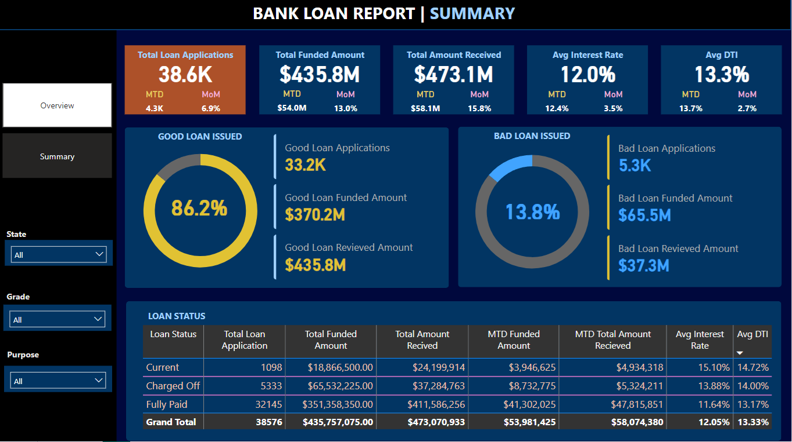

# 🏦 Bank Loan Performance & Risk Analysis 


---

## 📌 Project Overview

This project analyzes loan application performance, funding distribution, repayment behavior, and credit risk segmentation using SQL and Power BI.

The objective was to evaluate:

- Loan portfolio growth
- Risk exposure (Good vs Bad loans)
- Funding vs repayment performance
- Customer segmentation patterns
- Monthly performance trends

This project simulates a real-world banking analytics environment where decision-makers require KPI visibility and risk monitoring dashboards.

---

# 🎯 Problem Statement

Financial institutions must monitor:

- Total loan applications
- Funded capital vs collected repayments
- Interest rate & debt-to-income (DTI) patterns
- Loan default exposure
- Monthly growth trends

The goal was to build an interactive dashboard that enables management to:

1. Track portfolio performance
2. Monitor risk (Charged-Off loans)
3. Evaluate borrower profile segments
4. Support data-driven lending strategy decisions

---

# 🛠 Tools Used

- **MySQL** – Data extraction & KPI validation  
- **Power BI** – Dashboard development  
- **DAX** – KPI calculations & time intelligence  
- **Data Modeling** – Date Table + relationship management  
- **Time Intelligence Functions** – MTD, PMTD, MoM  

---

# 📊 Key KPIs Developed

### 📌 Portfolio Metrics
- Total Loan Applications
- Total Funded Amount
- Total Amount Received
- Average Interest Rate
- Average DTI

### 📌 Risk Segmentation
- Good Loan %
- Bad Loan %
- Good Loan Applications
- Charged-Off Loan Analysis

### 📌 Time Intelligence
- Month-to-Date (MTD)
- Previous Month-to-Date (PMTD)
- Month-over-Month Growth (MoM)

---

# 📈 Dashboard Pages

## 1️⃣ Overview Dashboard


Highlights:

- Loan application trend by month
- Loan distribution by state
- Term distribution (36 vs 60 months)
- Purpose segmentation
- Home ownership breakdown

---

## 2️⃣ Risk & Performance Summary



Highlights:

- Good vs Bad Loan Ratio
- Loan Status Breakdown
- Funded vs Received comparison
- Interest Rate & DTI per loan status

---

# 🧮 SQL Analysis

All KPIs were first validated in MySQL before dashboard integration.

Examples include:

- Aggregation queries
- Conditional risk classification
- Monthly trend analysis
- Grouped portfolio segmentation

Example KPI Query:

```sql
SELECT 
    ROUND(
        SUM(CASE 
            WHEN loan_status IN ('Fully Paid', 'Current') THEN 1 
            ELSE 0 
        END) * 100 / COUNT(*),
    2) AS Good_Loan_Percentage
FROM financial_loan;
```

---

# 📌 Business Insights

Based on the analysis:

### 1️⃣ Portfolio Quality
- 86% of loans are classified as Good Loans.
- 13.8% are Charged-Off (risk exposure).

This indicates relatively stable portfolio performance but requires monitoring of default risk.

---

### 2️⃣ Funding vs Collection
- Total Amount Received exceeds Funded Amount in certain segments.
- Indicates interest income contribution.

Opportunity:
Refine pricing strategy for high-performing segments.

---

### 3️⃣ Loan Term Distribution
- Majority of loans are 36-month term.
- 60-month loans may represent higher long-term risk exposure.

Recommendation:
Review default rates by term length.

---

### 4️⃣ Borrower Profile Patterns
Higher applications observed among:

- Rent & Mortgage homeowners
- Certain employment length groups

Opportunity:
Develop targeted risk-based pricing models.

---

# 🚀 Strategic Recommendations

1. Implement risk-adjusted lending thresholds for higher DTI applicants.
2. Monitor Charged-Off rate monthly with early warning indicators.
3. Segment high-performing borrower profiles for cross-sell opportunities.
4. Build predictive risk scoring using historical loan performance.

---

# 💼 Business Impact

This dashboard supports:

- Executive portfolio monitoring
- Risk management oversight
- Lending strategy optimization
- Monthly performance tracking

The structure and KPIs align with real-world banking analytics frameworks.

---


# 📬 Contact
**Tshedza Tshipuke**  
Aspiring Data Analyst  

- GitHub: https://github.com/Itspukke 
- LinkedIn: www.linkedin.com/in/tshedza-tshipuke-468516119
